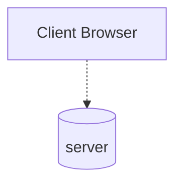

## What is a server?
A server is a representation of a messaging broker system where connections and communication between a producer and a consumer is established. Unlike traditional API servers which are dependent on request/response, message broker interactions occur back and forth over different channels.

## What is the purpose of servers?
Servers play an important role as they maintain a relationship between producers and consumers. When designing and setting up an event-driven application, servers are in charge of delivering asynchronous messages from the producer to the consumers through the use of channels. With the integration of different messaging protocols, servers can transmit and exchange messages between clients.

