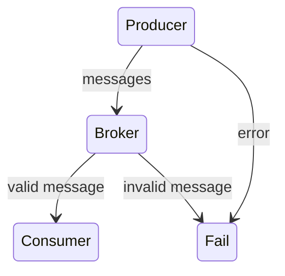
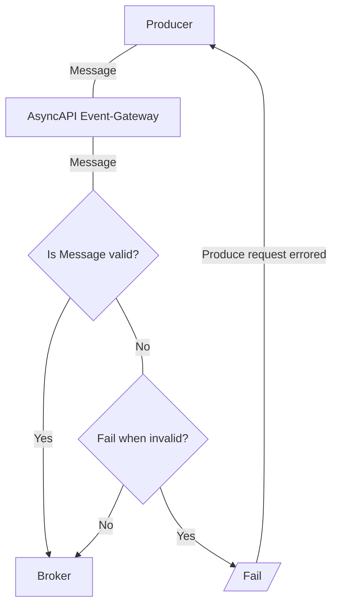
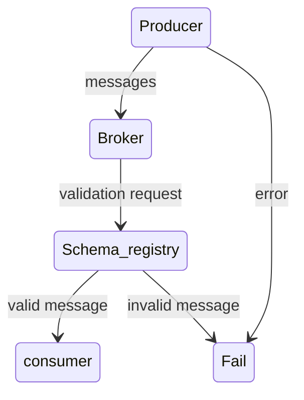

# Introduction
This guide will teach you how to validate the messages in runtime after creating your application using AsyncAPI.

# Message validation
To understand message validation, we must first understand the basic components involved.
- Producer: The producer is responsible for producing messages.
- Consumer: The consumer is responsible for getting the producer's messages.
- Broker: The broker acts as a bridge between the consumer and the producer because messages travel through the broker.

Both producers and consumers can do validation. Consumer-side validation happens by discarding invalid messages based on provided parameters.
Because consumers and producers cannot communicate directly, the AsyncAPI file dictates what should be included in the payload when a service produces a message. The AsyncAPI file also tells the consumer about the message's properties.


To validate AsyncAPI messages (events), we have two options: 
- [AsyncAPI schema validator](https://github.com/WaleedAshraf/asyncapi-validator): validates your messages against your AsyncAPI schema 
- [AsyncAPI event gateway](https://github.com/asyncapi/event-gateway): validates messages on a gateway before they reach the app. 

Let's further break down how validation works for both.

## AsyncAPI schema validation
The [AsyncAPI schema validator](https://github.com/WaleedAshraf/asyncapi-validator) is a message validator for AsyncAPI schema. 

### `messageId` validation method
The `messageId` is defined in [AsyncAPI Schema v2.4.0](https://www.asyncapi.com/docs/reference/specification/v2.4.0#messageObject).
<CodeBlock>
`.validateByMessageId(key, payload)`
</CodeBlock>

1. Create an AsyncAPI document:
<CodeBlock language="yaml">
{`cat <<EOT >> asyncapi.yaml
asyncapi: 2.0.0
info:
  title: User Events
  version: 1.0.0
channels:
  user-events:
    description: user related events
    publish:
      message:
        name: UserDeletedMessage
        x-custom-key: UserDeleted
        payload:
          type: object
          properties:
            userEmail:
              type: string
            userId:
              type: string
              EOT`}
</CodeBlock>

2. Validate incoming MQTT messages by loading the AsyncAPI schema definition via the `fromSource` method. 

<CodeBlock>
{`const AsyncApiValidator = require('asyncapi-validator')
let va = await AsyncApiValidator.fromSource('./api.yaml')
// validate messageId 'UserRemoved'
va.validateByMessageId('UserRemoved', {
  userId: '123456789',
  userEmail: 'alex@mail.com',
})`}
</CodeBlock>

## AsyncAPI gateway validation
AsyncAPI gateway intercepts all incoming messages and routes them through the middleware and handler pipelines. The AsyncAPI gateway sits between the producer and the broker. The messages are routed through the gateway first, and the gateway determines whether the message is valid. If the message is invalid, it displays an error and is not forwarded to the broker.

<Remember>
Currently, only the Kafka protocol is supported.
</Remember>


You can spin up the AsyncAPI gateway using an AsyncAPI file. All the messages are forwarded to a WebSocket endpoint; if the message/payload is invalid, it includes a validation error message.

### UseCase
You can use a Kafka consumer/producer[(kcat)](https://github.com/edenhill/kcat), a broker, and a simple WebSocket to run the AsyncAPI gateway in your machine.
```
type: object
properties:
  lumens:
    type: integer
    minimum: 0
    description: Light intensity measured in lumens.
  sentAt:
    type: s
    format: date-time
    description: Date and time when the message was sent.
 ```
Here the expected payload `lightMeasured` is an integer. A validation error will be included if the producer sends a message with the type boolean.
 ```
 "_asyncapi_eg_validation_error": "{\"ts\":\"2021-12-20T11:33:26.583143572Z\",\"errors\":[\"lumens: Invalid type. Expected: integer, given: boolean\"]}",
 ```
## Native broker validation
Native broker validation enables the broker to verify that messages produced by a consumer use a valid schema ID in the Schema Registry of your environment. If it is valid, messages are passed on to the consumer.
 


Native broker validation can also be implemented using methods other than AsyncAPI. AsyncAPI will still work even if your payload is stored somewhere other than the schema registry; you don't need to create separate applications.

# Additional Resources
- Check out an [AsyncAPI file demo with Studio.](https://studio.asyncapi.com/?url=https://raw.githubusercontent.com/asyncapi/event-gateway/master/deployments/k8s/event-gateway-demo/event-gateway-demo.asyncapi.yaml)

- Check out other [AsyncAPI validators](https://www.asyncapi.com/docs/tools#validators)

---

<DocsButton
  suggestions={[
    {
      href: '/docs/guides/validate',
      title: 'Validate AsyncAPI Documents',
      type:'back',
    },
    {
      href: '/docs/reference',
      title: 'Overview',
      type:'next',
    }
  ]}
/>
