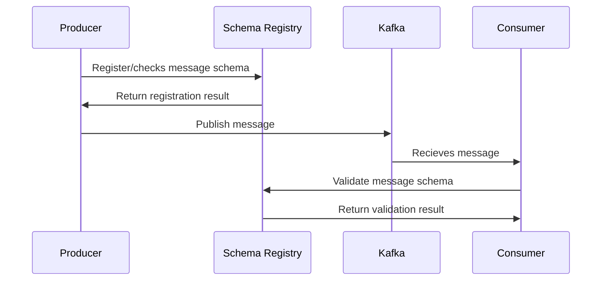

## Introduction
This guide explains different concepts of validating AsyncAPI messages. You will also learn what role AsyncAPI documents play in validation.

## Message validation
To understand AsyncAPI message validation, we must first understand the basic components involved.
- Producer: responsible for producing messages.
- Consumer: responsible for getting the producer's messages.
- Broker: acts as a bridge between the consumer and the producer because messages travel through the broker.

Message validation can occur in different places in your system. This guide highlights three of those:
- Both producers and consumers can do validation internally during runtime.
- API Gateway can handle message validation.
- Validation of messages can be a native solution implemented by the Schema Registry.
Because consumers and producers cannot communicate directly, the AsyncAPI file dictates what should be included in the payload when a service produces a message. The AsyncAPI document also tells the consumer about the message's properties.
Let's further break down how validation works for all.

### Runtime validation
Messages produced and consumed are both required for runtime message validation. The AsyncAPI document should include descriptions of payload schemas so that you can read them in your application and validate messages that are consumed and produced by the application.

Before messages reach the consumer, runtime validation ensures that any errors are resolved and valid messages are sent to your application.

An example implementation of message validation in runtime is the [asyncapi-validator](https://github.com/WaleedAshraf/asyncapi-validator) library that enables you to validate messages produced/consumed in your application against schemas provided in your AsyncAPI document.
Check out the [message validation in the runtime](https://www.asyncapi.com/docs/tutorials/message-validation) tutorial if you want to get your hands dirty with message validation. 


### Gateway validation
A gateway intercepts all incoming messages and routes them through the middleware and handler pipelines. The gateway sits between the producer and the broker. First, the messages are routed through the gateway, and then the gateway determines whether the message is valid. If the message is invalid, it displays an error and is not forwarded to the broker.

An example implementation of message validation in a gateway is the [AsyncAPI gateway](https://github.com/asyncapi/event-gateway). It intercepts all incoming messages moving them into a pipeline of middlewares and handlers such as message validation. You can use a Kafka consumer/producer[(kcat)](https://github.com/edenhill/kcat), a broker, and a simple WebSocket to run the AsyncAPI gateway in your machine.
Check out an [AsyncAPI file demo with Studio](https://studio.asyncapi.com/?url=https://raw.githubusercontent.com/asyncapi/event-gateway/master/deployments/k8s/event-gateway-demo/event-gateway-demo.asyncapi.yaml) to learn more about how an AsyncAPI file can be used in gateway validation.

<Remember>
Currently, only the Kafka protocol is supported.
</Remember>


The AsyncAPI document is important because payload schemas are taken from it, and messages are validated against it in your application.
You can spin up the AsyncAPI gateway using an AsyncAPI file. All the messages are forwarded to a WebSocket endpoint; if the message/payload is invalid, it includes a validation error message.

### Schema Registry validation
Producers and consumers do not communicate with each other directly; rather, information transfer happens via Kafka. At the same time, the consumer still needs to know the type of data the producer is sending. Imagine if the producer starts sending bad data to Kafka or if the data type of your data gets changed. We need a way to have a common data type that must be agreed upon.

This is where Schema Registry comes into play. It is an application that runs outside your Kafka protocol and handles schema distribution to producers and consumers by storing a copy of the schema in its local cache and validating them in Kafka.



With the Schema Registry in place, the producer first talks to the Schema Registry and checks if the schema of the message it wants to send is available before sending it to the broker. If it cannot locate the schema, it registers it in the Schema Registry. Then the producer sends a message to the broker prefixed with a unique schema ID. When the consumer processes this message, it will communicate with the Schema Registry using the schema ID obtained from the producer. If there is a schema mismatch, the Schema Registry will throw an error, informing the producer that it violates the schema agreement.

AsyncAPI is not directly involved in validation based on the Schema Registry. The good thing is that you do not have to duplicate schemas in your AsyncAPI document stored in Schema Registry. You can reference schemas from Schema Registry in your AsyncAPI documents.
Here's an example of an AsyncAPI document where you can see both `schemaFormat` and `payload` referenced from the Schema Registry:
```yml
asyncapi: 2.6.0
info:
  title: Example with Avro
  version: 0.1.0
channels:
  example:
    publish:
      message:
        schemaFormat: 'application/vnd.apache.avro;version=1.9.0'
        payload:
          $ref: 'https://example.europe-west3.gcp.confluent.cloud/subjects/test/versions/1/schema'
```

---

