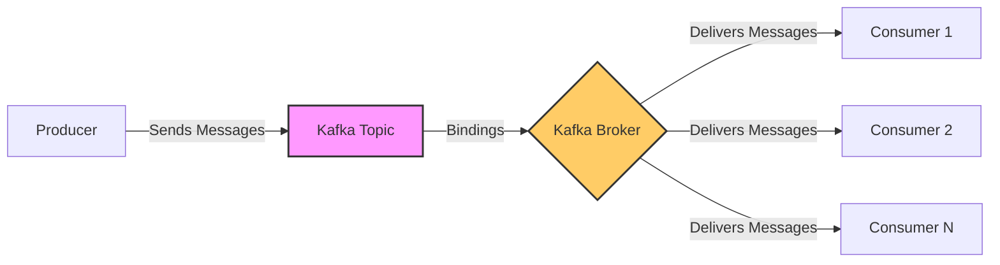

## Introduction

In this tutorial, you will learn how bindings with Kafka works. You will learn how to extend your AsyncAPI document with Protocol-specific information, such as how to specify kafka topic-specific configurations or how to define kafka message key content.

## Background Context

**What is Kafka**

Kafka is a messaging system that allows for the efficient handling and processing of data streams. 

**What is binding?**

In the context of Kafka, "bindings" refer to the connections between Kafka and other systems or applications. There are several levels of bindings as described below:

- Server Bindings
- Channel Bindings
- Operation Bindings

**How binding works with Kafka**

You must understand some essential parts of the process to understand how binding works. 

Kafka as a messaging system - Think of Kafka as a courier service - A messaging system that handles sending and receiving messages between applications. 

Producers and Consumers - Producers send packages (messages) to the courier service (Kafka), and consumers receive these packages.

Topics: Kafka organizes messages into categories. Just like a courier service, it will group items based on several cases, like how heavy the package is or the arrival date. It’s like having different boxes for different messages.

Bindings: Bindings are relevant when integrating Kafka with other programs or services. A binding is a specific agreement or configuration that governs how an application connects to and interacts with Kafka. It can include information such as:

- Which topics should an application read from or write to?
- How should messages be formatted?
- What are the rules for interacting with various forms of data or messages?

Bindings are important because they indicate how Kafka components are configured.

The diagram below shows how bindings with Kafka works. 

In the diagram above;

- The **producer** represents the system or service that transmits messages to Kafka.

- **Kafka Topic**: The name of the category or feed where messages are stored.

- **Bindings**: The connection or configuration between Kafka topics and the broker.

- **Kafka Broker**: The central node in charge of message distribution.

- **Consumer 1, 2, N**: Various systems or services that receive Kafka messages.

Now, let’s see how to use bindings with Kafka.

## Installation Guide

<!---
Step 1 - Server bindings
Step 2 - Channel Bindings
Step 3 - Operation Bindings
--->

## Summary
## Next Steps

