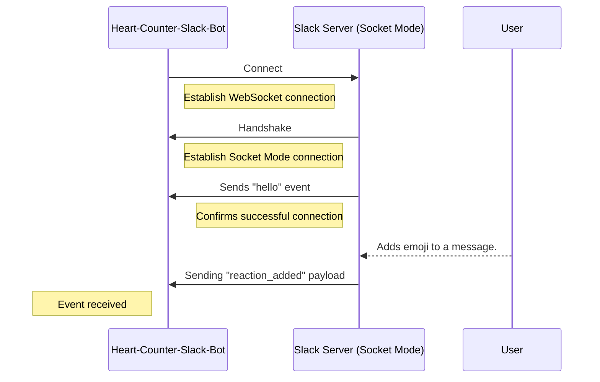
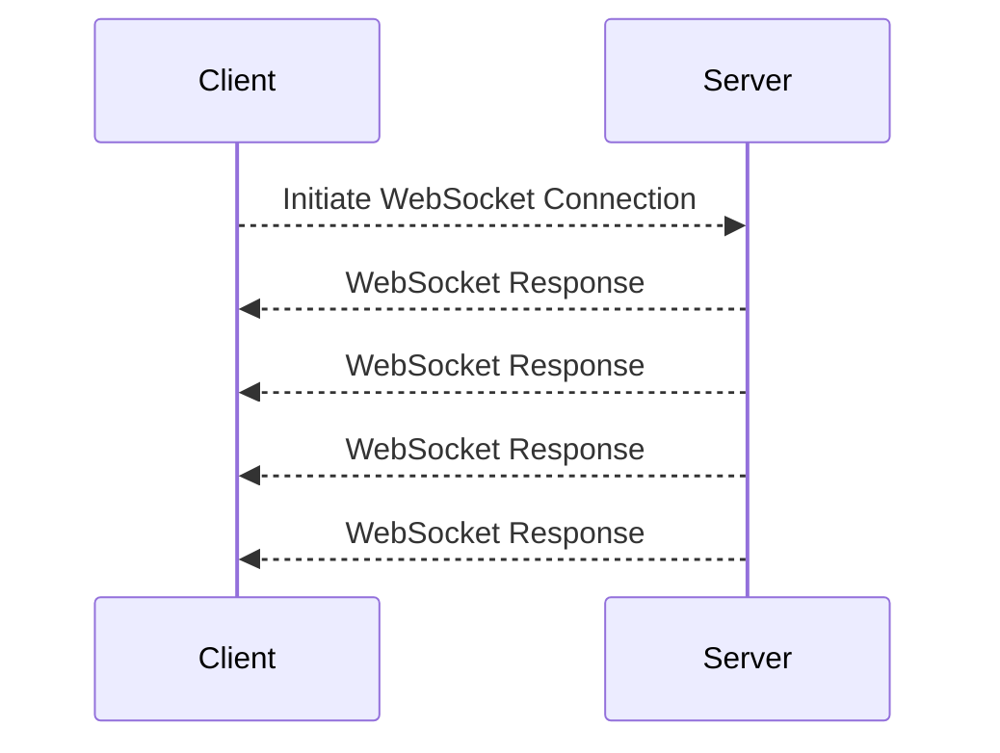

## Introduction
In this tutorial, you will learn how to generate an AsyncAPI document designed for a Slack application that operates in Socket Mode. The aim is to help you grasp a real-world application of AsyncAPI with the WebSocket protocol.

Consider a scenario where you are in charge of maintaining a highly active Slack workspace. You want an easy way to keep track of the popular messages across all the channels but doing this manually would be a difficult task. To simplify this process, you’re going to build a Slackbot called `Heart-Counter-Slack-Bot` that actively monitors reactions added to a message and determine its popularity by counting the reactions of the “heart” emoji.

Here’s a visual representation of how `Heart-Counter-Slack-Bot` should work: 



## Background context
[WebSocket](https://en.wikipedia.org/wiki/WebSocket) is a communication protocol that enables simultaneous bidirectional data exchange between a client and a server over a single, long-lived connection. Unlike HTTP, which relies on the request-response model, WebSocket is ideal for scenarios where real-time, interactive and low-latency communication is necessary.




In Slack, WebSocket is employed as part of its [Socket Mode](https://api.slack.com/apis/connections/socket) feature to facilitate real-time notifications between Slack's servers and third-party applications or bots. The [Slack Event API](https://api.slack.com/apis/connections/events-api) is a tool that lets you receive real-time notifications of specific events in a Slack workspace such as messages, reactions, and user presence changes.


## Define AsyncAPI Version, API Information, and Server

You start your AsyncAPI document by specifying the AsyncAPI version and essential information about your Slack application's API which includes details such as the `title`, `version` and `description`.

The `ws` server section allows you to define the protocol and specify information about the URLs your application will use, such as  `host`, `protocol` and `description`.

<Remember>
The WebSocket URL is generated  by invoking the <a href="https://api.slack.com/methods/apps.connections.open">apps.connections.open</a> method from Slack’s API. You use the authentication tokens obtained during the configuration of  <code>Heart-Counter-Slack-Bot</code> to generate this URL.
</Remember>

```
asyncapi: '3.0.0'
info:
  title: Create an AsyncAPI Document for a SlackBot with WebSockets
  version: '1.0.0'
  description:  |
    The Heart-Counter-Slack-Bot manages popular messages in a Slack workspace by monitoring message reaction data using Slack's Event API.
    
servers:
  ws:
    host: wss://wss-primary.slack.com/
    protocol: wss
    description: Websocket URL generated to communicate with Slack
```


## Define Channels and  Bindings

The `channels` attribute defines a communication channel for the event. The `address` specifies where the channel is tuned in to receive messages while the `messages` property defines a key-value pair where each key corresponds to the event it's set up to handle.

The WebSocket URL generated for `Heart-Counter-Slack-Bot` includes authentication tokens, and this protocol-specific data is represented using the `bindings` attribute. By utilizing the `query` object, you can outline the parameters needed for the connection and the conditions they must meet. 

```
channels:
  root:
    address: /
    messages:
      helloListener:
        $ref: '#/components/messages/helloListenerMessage'
      reactionListener:
        $ref: '#/components/messages/reactionListenerMessage'

    bindings:
      ws:
        query:
          type: object
          description: Contains the authentication tokens for the WebSocket URL
          properties:
            ticket:
              type: string
              const: '13748dac-b866-4ea7-b98e-4fb7895c0a7f'
            app_id:
              type: string
              const: 'fe684dfa62159c6ac646beeac31c8f4ef415e4f39c626c2dbd1530e3a690892f'
```

## Define Operations 
The `operation` property, is all about defining specific tasks your application can perform. Essentially, it's how `Heart-Counter-Slack-Bot` interacts with Slack.

In this example, the `helloListenerOperation` keeps an eye out for the message sent by the Slack server when a WebSocket connection is successfully established. On the other hand, the `reactionListener` is focused on the `reaction_added` event type.

Your Slack application is designed to be notified of events within your workspace. It does this by subscribing to a specific event type making use of Slack's Event API.  So in this case the `action` property in both the operations is set to `receive` events.

```
operations:
  helloListenerOperation:
    action: receive
    channel:
      $ref: '#/channels/root'
    messages:
      - $ref: '#/channels/root/messages/helloListener'

  reactionListenerOperation:
    action: receive
    channel: 
      $ref: '#/channels/root'
    messages:
      - $ref: '#/channels/root/messages/reactionListener'
```

## Define Messages and Schemas

Your AsyncAPI document needs to be very clear on the type of event it is expected to receive. Here's where the `messages` component steps in. Using the `payload` property, you can specify what these events should look like, their structure, and what content they carry.

That leads us to the function of the `payload` attribute. It specifies the name, format, and description of all expected properties, and can even set constant values that must be followed during schema validation.
For example, in `reactionPayload` schema definition, any API message received from this channel must follow the constant value for the `reaction` property which is clearly defined as “heart”.

The `const` value feature ensures that the data exchanged through your API complies with your specified constants, helping to maintain data integrity and accuracy.

```
components:
  messages:
    reactionListenerMessage:
      summary: "Action triggered when channel receives a new event of type reaction-added"
      payload:
        $ref: '#/components/schemas/reactionPayload'
    
    helloListenerMessage:
      summary: "Action triggered when a successful WebSocket connection is established."
      payload:
        $ref: '#/components/schemas/helloPayload'

  schemas:
    reactionPayload:
      type: object
      properties:
        user:
          type: string
          description: ID of the user who performed this event
        reaction:
          type: string
          description: The only reaction that we need is a heart emoji
          const: "heart"
        item_user:
          type: string
          description: ID of the user that created the original item that has been reacted to
        item:
          type: object
          properties:
            channel:
              type: string
              description: Channel information of original message
            ts:
              type: string
              description: Timestamp information of original message.
        event_ts:
          type: string
          description: Timestamp of reaction

    helloPayload:
      type: object
      properties:
        type:
          type: string
          description: A hello string confirming WS connection
          const: "hello"
        connection_info:
          type: object
          properties:
            app_id:
              type: string
        num_connections:
          type: integer
        debug_info:
          type: object
          properties:
            host:
              type: string
            started:
              type: string
            build_number:
              type: integer
            approximate_connection_time:
              type: integer
```


You've now completed the tutorial! Putting these blocks together gives you your AsyncAPI document all ready to go.

```
asyncapi: '3.0.0'
info:
  title: Create an AsyncAPI Document for a SlackBot with WebSockets
  version: '1.0.0'
  description:  |
    The Heart-Counter-Slack-Bot manages popular messages in a Slack workspace by monitoring message reaction data using Slack's Event API.
    
servers:
  ws:
    host: wss://wss-primary.slack.com/
    protocol: wss
    description: Websocket URL generated to communicate with Slack

channels:
  root:
    address: /
    messages:
      helloListener:
        $ref: '#/components/messages/helloListenerMessage'
      reactionListener:
        $ref: '#/components/messages/reactionListenerMessage'

    bindings:
      ws:
        query:
          type: object
          description: Contains the authentication tokens for the WebSocket URL
          properties:
            ticket:
              type: string
              const: '13748dac-b866-4ea7-b98e-4fb7895c0a7f'
            app_id:
              type: string
              const: 'fe684dfa62159c6ac646beeac31c8f4ef415e4f39c626c2dbd1530e3a690892f'

operations:
  helloListenerOperation:
    action: receive
    channel:
      $ref: '#/channels/root'
    messages:
      - $ref: '#/channels/root/messages/helloListener'

  reactionListenerOperation:
    action: receive
    channel: 
      $ref: '#/channels/root'
    messages:
      - $ref: '#/channels/root/messages/reactionListener'

components:
  messages:
    reactionListenerMessage:
      summary: Action triggered when the channel receives a new reaction-added event
      payload:
        $ref: '#/components/schemas/reactionPayload'
    
    helloListenerMessage:
      summary: Action triggered when a successful WebSocket connection is established.
      payload:
        $ref: '#/components/schemas/helloPayload'

  schemas:
    helloPayload:
      type: object
      properties:
        type:
          type: string
          description: A hello string confirming WebSocket connection
          const: "hello"
        connection_info:
          type: object
          properties:
            app_id:
              type: string
        num_connections:
          type: integer
        debug_info:
          type: object
          properties:
            host:
              type: string
            started:
              type: string
            build_number:
              type: integer
            approximate_connection_time:
              type: integer
              
    reactionPayload:
      type: object
      properties:
        user:
          type: string
          description: User ID who performed this event
        reaction:
          type: string
          description: The only reaction that we need is a heart emoji
          const: "heart"
        item_user:
          type: string
          description: User ID that created the original item that has been reacted to
        item:
          type: object
          properties:
            channel:
              type: string
              description: Channel information of original message
            ts:
              type: string
              description: Timestamp information of original message.
        event_ts:
          type: string
          description: Reaction timestamp
```


## Summary
In this tutorial, you learned to create an AsyncAPI document for a SlackBot using WebSocket in Socket Mode. You gained practical insights into the functionality of operations, channels, messages, and schemas. Now you're equipped to handle real-world applications that facilitates bidirectional real-time data exchange such as chatbots and live-streaming platforms.
