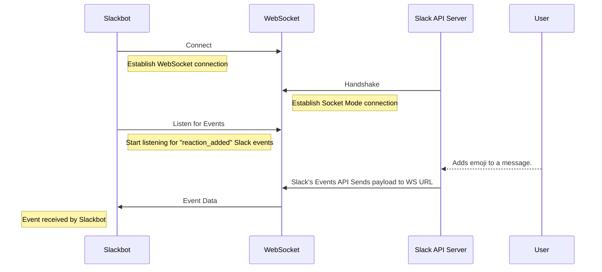
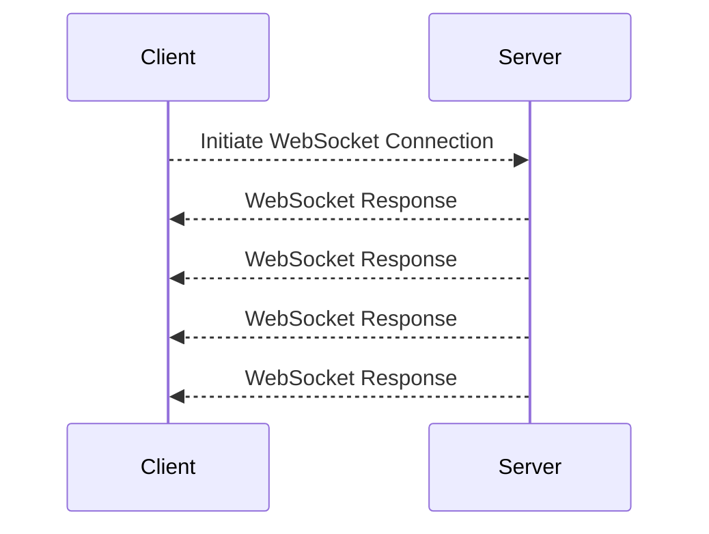
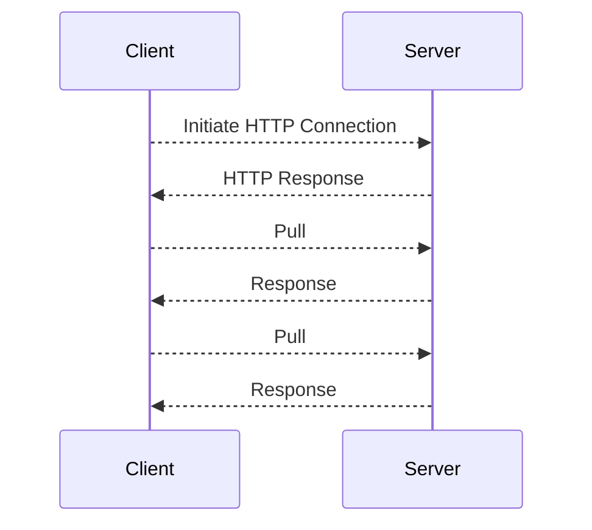

## Introduction
In this tutorial, you will learn how to generate an AsyncAPI document designed for a Slack application that operates in Socket Mode. Our aim is to help you grasp a real-world application of AsyncAPI with the WebSocket protocol.

Consider a scenario where you are in charge of maintaining a highly active Slack workspace. You want an easy way to keep track of the popular messages across all the channels but doing this manually would be a difficult task. To simplify this process, you’re going to build a Slackbot that actively monitors reactions added to a message and determine its popularity by counting the reactions of the “heart” emoji.

Here’s a visual representation of how your Slackbot should work.



## Background context
[WebSocket](https://en.wikipedia.org/wiki/WebSocket) is a communication protocol that enables full-duplex, bidirectional data exchange between a client and a server over a single, long-lived connection. Unlike HTTP, which relies on the request-response model, WebSocket is ideal for scenarios where real-time, interactive and low-latency communication is necessary.






In Slack, WebSocket is employed as part of its [Socket Mode](https://api.slack.com/apis/connections/socket) feature to facilitate real-time notifications between Slack's servers and third-party applications or bots. Socket Mode makes it easier to create Slack apps without dealing with complex infrastructure issues. Building these apps using HTTP had challenges when working from certain environments. With Socket Mode, this becomes simpler and more feature-rich for app developers.


The [Slack Event API](https://api.slack.com/apis/connections/events-api) is a tool that lets developers receive real-time notifications of specific events in a Slack workspace. By subscribing to event types like messages, reactions, and user presence changes, third-party apps can react to these events instantly. The API enhances automation and interactivity within the Slack platform, making it a powerful resource for building custom integrations and chatbots.

## Create AsyncAPI document
In this section, you will learn how to write an AsyncAPI document for the Slackbot. The document will serve as a resource for understanding and interacting with your Slackbot, making it easier for others to integrate and work with your API.

**Step 1: Define AsyncAPI Version, API Information, and Server**

```
asyncapi: '3.0.0'
info:
  title: SlackBot API
  version: '1.0.0'
  description:  |
    The SlackBot App manages popular messages in a workspace by monitoring message reaction data from Slack's Event API.
    
servers:
  ws:
    host: wss.slack.com/
    pathname:  ticket=$ticketId&app_id=$appId      
    protocol: ws
    description: "Websocket URL generated to communicate with Slack"

```
You start your AsyncAPI document by specifying the AsyncAPI version and essential information about your Slackbot API which includes details such as the `title`, `version` and `description`.

In the `ws` server section, the WebSocket URL is generated at runtime by invoking the [apps.connections.open](https://api.slack.com/methods/apps.connections.open) method from Slack’s API. You use the authorization tokens obtained during the Slackbot configuration to generate this URL.

**Step 2 : Define Operations and Channels**

```
channels:
  reactionListener:
    address: /
    messages:
      reactionListener:
        $ref: '#/components/messages/reactionListenerMessage'


operations:
  reactionListenerOperation:
    action: receive
    channel: 
      $ref: "#/channels/reactionListener"
```
The  `operation` property, which we'll explore through the `reactionListenerOperation` is all about defining specific tasks your application can perform. Essentially, it's how your Slackbot interacts with Slack.

Your Slackbot is designed to be notified of events within your workspace. It does this by subscribing to a specific event type making use of Slack's Event API.  So in this case the `action` property is set to receive events.

Now, moving on to the `channel` section, you have the `reactionListener` channel that is set to to receive events from Slack. The `address` specifies where the channel is tuned in to receive messages while the `messages`  property  defines the structure of the event it's set up to handle.

**Step 3: Define Messages and Schemas**

Next up comes the  `messages` section and this is where things get slightly technical. In the context of your Slackbot, it actively listens for the "reaction_added" event type which gets triggered each time a user reacts to a message using an emoji.

Your AsyncAPI document needs to be very clear on the type of event it is expected to receive. Here's where the `messages` component steps in. Using the `payload` property, you can specify what these events should look like, their structure, and what content they carry.

```
components:
  messages:
    reactionListener:
      summary: "Action triggered when channel receives a new event of type reaction-added"
      payload:
        $ref: '#/components/schemas/reactionPayload'


  schemas:
    reactionPayload:
      type: object
      properties:
        user:
          type: string
          description: ID of the user who performed this event
        reaction:
          type: string
          description: The only reaction that we need is a heart emoji
          const: "heart"
        item_user:
          type: string
          description: ID of the user that created the original item that has been reacted to
        item:
          type: object
          properties:
            channel:
              type: string
              description: Channel information of original message
            ts:
              type: string
              description: Timestamp information of original message.
        event_ts:
          type: string
          description: Timestamp of reaction
```
And that brings us to what the `payload` attribute does. It specifies the name, format, and description of all expected properties, and can even set constant values that must be followed during schema validation.
For example, in this schema definition, any API message received from this channel must follow the constant value for the "reaction" property which is clearly defined as “heart”.

The const value feature ensures that the data exchanged through your API complies with your specified constants, helping to maintain data integrity and accuracy.

And there you have it! Putting these blocks together gives you your AsyncAPI document all ready to go.

```
asyncapi: '3.0.0'
info:
  title: SlackBot API
  version: '1.0.0'
  description:  |
    The SlackBot App manages popular messages in a workspace by monitoring message reaction data from Slack's Event API.
    
servers:
  ws:
    host: wss.slack.com/
    pathname:  ticket=$ticketId&app_id=$appId      
    protocol: ws
    description: "Websocket URL generated to communicate with Slack"

channels:
  reactionListener:
    address: /
    messages:
      reactionListener:
        $ref: '#/components/messages/reactionListenerMessage'

operations:
  reactionListenerOperation:
    action: receive
    channel: 
      $ref: "#/channels/reactionListener"

components:
  messages:
    reactionListenerMessage:
      summary: "Action triggered when channel receives a new event of type reaction-added"
      payload:
        $ref: '#/components/schemas/reactionPayload'

  schemas:
    reactionPayload:
      type: object
      properties:
        user:
          type: string
          description: ID of the user who performed this event
        reaction:
          type: string
          description: The only reaction that we need is a heart emoji
          const: "heart"
        item_user:
          type: string
          description: ID of the user that created the original item that has been reacted to
        item:
          type: object
          properties:
            channel:
              type: string
              description: Channel information of original message
            ts:
              type: string
              description: Timestamp information of original message.
        event_ts:
          type: string
          description: Timestamp of reaction
```


## Summary
In this tutorial, you were introduced to a practical application of WebSocket protocols within an AsyncAPI document. In our future tutorials, we'll dive deeper into more advanced concepts and explore the extensive features of AsyncAPI. 

