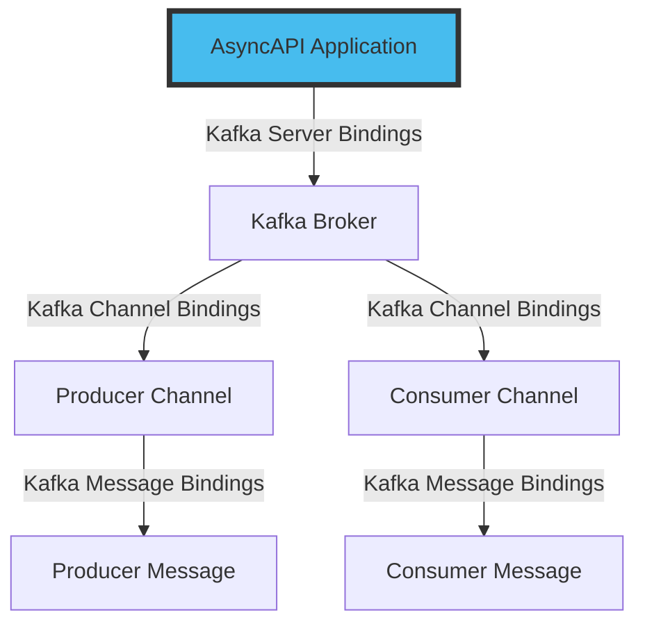

## Introduction

In a previous tutorial, you learnt how to manage schemas with schema registry. In this tutorial, you will learn how bindings with Kafka work by defining Kafka message key content and extending your AsyncAPI document with protocol-specific information.

## Background Context

Bindings are crucial to an Event-driven application as they provide protocol-specific information that abstracts the details of how protocols handle messages from the core logic of your application. Bindings improve the understanding and usability of the API by offering more setup options and context for various protocols. It includes information such as topics an application reads from or writes to, how the messages are formatted, and the rules for interacting with multiple data or messages. 

In an AsyncAPI document, bindings can be appended to different document sections, such as servers, channels, or messages. They include standard information that is unique to a particular protocol. Bindings definitions allow you to specify the protocol-specific functionalities not supported by AsyncAPI's core features.

You can configure several objects using Kafka bindings. However, for the scope of this tutorial, we are focusing on three levels of bindings: [server bindings](https://github.com/asyncapi/bindings/tree/master/kafka#server-binding-object), [channel bindings](https://github.com/asyncapi/bindings/tree/master/kafka#channel-binding-object) and [message bindings](https://github.com/asyncapi/bindings/tree/master/kafka#message-binding-object).

The diagram below shows how bindings with Kafka work. 

## Add server bindings

Server bindings provide protocol-specific configuration details for connecting and interacting with a server.

## Add channel bindings

Channel bindings provide protocol-specific information for a particular channel. For example, in Kafka, you can specify number of partitions or replicas for a given topic.

## Add message bindings

Message bindings provide protocol-specific information for a specific message. Like the Kafka topic it's associated with, message key (if any), and Kafka-specific properties.

## Summary

In this tutorial, you learned how to configure server and channel bindings. You also learned that bindings are essential in integrating Kafka with different systems, platforms, or protocols, especially in API specifications like AsyncAPI. 

## Next Steps

Now that you have completed this tutorial, you can [learn more about other Kakfa bindings](https://github.com/asyncapi/bindings/tree/master/kafka) or [protocol-specific bindings](https://github.com/asyncapi/bindings).
