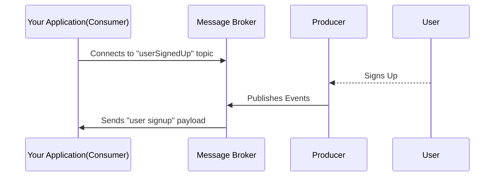

## Introduction

The tutorial will walk you through the process of creating an schema document for Kafka Messages using AsyncAPI. Additionally, you will also learn about event-driven architecture, pub/sub model, and brokers in relation to Kafka. 
  
Let’s assume, you have a service that publishes data to a Kafka topic whenever a new user signs up into the application.

Basically, you want to build a system that can track the users who have signed up for your application, the entire flow of the application would be:




## Background context

[Event-driven architecture (EDA)](/docs/tutorials/getting-started/event-driven-architectures) is a design pattern that revolves around the production, detection, and reaction to events over time. It consists of three main components: a message broker, event publishers, and subscribers, which together serve as the backbone for event exchange within different services. 

[Message brokers](/docs/tutorials/getting-started/event-driven-architectures#message-broker) facilitate asynchronous communications between services, meaning that the sending service doesn't have to wait for the receiving service's response. This allows multiple services to talk to each other directly, even if they are written in different languages. A great example of such a message broker is Apache Kafka. [Apache Kafka](https://kafka.apache.org/) is a distributed system that is used by thousands of companies for their event-driven system.

[Publish/Subscribe (Pub/Sub)](/docs/tutorials/getting-started/event-driven-architectures#publishersubscriber) is a typical model in EDAs, providing flexible coupling between publishers and subscribers. In this model, the publishers of event notifications act as publishers and the consumers act as corresponding subscribers.

## Creating AsyncAPI document for Kafka

In this section, you’ll create an AsyncAPI document to describe the `UserSignUp` API. The same document can be later used to generate code and documentation as per requirement.

Let's begin by analysing the document. As we move forward in the tutorial, we'll break down each segment uncovering its purpose and functionality.

```
asyncapi: 3.0.0
info:
  title: User Signup API
  version: 1.0.0
  description: The API notifies you whenever a new user signs up in the application.

servers:
  kafkaServer:
    host: test.mykafkacluster.org:8092
    description: Kafka Server
    protocol: kafka

operations:
  onUserSignedUp:
    action: receive
    channel:
      $ref: '#/channels/userSignedUp'

channels:
  userSignedUp:
    description: This channel contains a message per each user who signs up in our application.
    address: user_signedup
    messages:
      userSignedUp:
        $ref: '#/components/messages/userSignedUp'

components:
  messages:
    userSignedUp:
      payload:
        type: object
        properties:
          user-id:
            type: integer
            description: This property describes the id of the user
          user-email:
            type: string
            description: This property describes the email of the user
```

Let's now break it down into pieces:

### Define AsyncAPI version, API information, and server

Initially, you need to describe your application, including the AsyncAPI version, the info about the document, and the server your application is based upon.

```
asyncapi: 3.0.0
info:
  title: User Signup API
  version: 1.0.0
  description: The API notifies you whenever a new user signs up in the application.
servers:
  kafkaServer:
    host: test.mykafkacluster.org:8092
    description: Kafka Server
    protocol: kafka
```

In the above snippet:

- The `asyncapi` field indicates that you are using AsyncAPI version 3.0.0.
  
- The `info` field provides information about the API. Here the the APIs `title`, `version`, and `description` are being defined.
  
- The `server` field specifies the details of the server, including the `host`, `description`, and the `protocol` that is being used i.e. Kafka.

### Define channels and operations

Next, let's move on to the `channels` and `operations` section. The channel addresses are the topics in Kafka, they are the routes to which your API will be sending/receiving. The `operations` section is used to describe how your application interacts with the channels.

```
operations:
  onUserSignedUp:
    action: receive
    channel:
      $ref: '#/channels/userSignedUp'


channels:
  userSignedUp:
    description: This channel contains a message per each user who signs up in our application.
    address: user_signedup
    messages:
      userSignedUp:
        $ref: '#/components/messages/userSignedUp'
```

In the above snippet:

- The `onUserSignedUp` object specifies the nature of the operation. The `action` property indicates that our application will be receiving the information. The `channel` property points to the channel where the operation occurs.
  
- The `userSignedUp` object inside `channels` describes the Kafka topic where our application will be receiving the information and the associated message definition. The `address` field represents the actual name of the Kafka topic. The `messages` field describes the expected messages in that topic. 

### Define messages and its schemas

Finally, you'll define the messages and their payload. The payload defines how the event would look line that will be sent from the channel.

```
components:
  messages:
    userSignedUp:
      payload:
        type: object
        properties:
          user-id:
            type: integer
            description: This property describes the id of the user
          user-email:
            type: string
            description: This property describes the id of the user
```

In the above snippet:

- The `userSignedUp` message is defined which describes the payload (content) of the message.
  
- The `payload` property defines the content of the message using [JSON Schema](https://json-schema.org/). It means that your message payload should contain a `user-id` which is an integer and a `user-email` property which is a string property.

## Summary

The ability to generate an AsyncAPI document for Kafka is now in your toolkit. You generated an AsyncAPI document that defines the structure of the Kafka messages in a machine-readable format which makes it easier to maintain event-driven architecture. Try adding your own business logic and playing around with it.

## Next steps

Now that you know how to write an AsyncAPI document for Kafka messages using the default schema, let's proceed to learn how to compose an AsyncAPI document using Avro Schema instead. 
