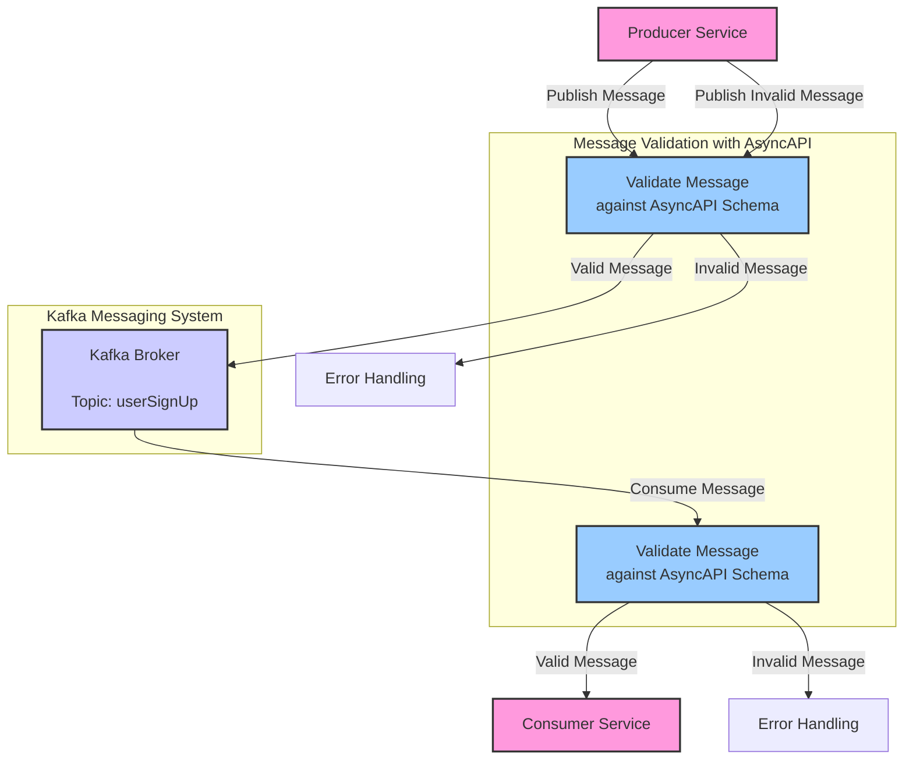

This tutorial will teach you how to validate messages within a Kafka-based system using AsyncAPI specifications.

Validating messages for Kafka involves defining message schemas using AsyncAPI, and then using those schemas to validate incoming and outgoing messages in your Kafka-based applications. 

By the end of the tutorial, you should understand the importance of message validation, know how to specify message schemas using AsyncAPI, and apply validation to ensure that the messages exchanged between different components in a Kafka-based system are consistent and adhere to predefined rules.

## Background context

Message validation involves checking that the messages exchanged between systems adhere to a predefined structure or schema. It helps in ensuring that the data being sent or received is accurate, complete, and in the expected format.

Kafka transports messages between producers and consumers, while AsyncAPI provides a contract (schema) that those messages must adhere to. Validation tools can use the AsyncAPI specifications to check whether the messages meet the criteria before they are sent or processed.

[Kafka](https://kafka.apache.org/documentation/#intro_nutshell) is a distributed event streaming platform for building real-time data pipelines and streaming apps. It's horizontally scalable, fault-tolerant, and swift.

[AsyncAPI](https://www.asyncapi.com/docs) is an open-source initiative that provides a specification for defining and documenting synchronous and asynchronous APIs. It acts as a contract that ensures all system components agree on the structure of messages for effective communication.

To follow this tutorial, you need:

* A knowlegde of Kafka and AsyncAPI.
* An understanding of Event driven Architectures (EDAs).

## Installation guide

[Comment] - What goes in the installation guide?

	
## Broker-level message validation

<!--- 
Integrating message validation with Kafka producers
Validating outgoing messages before sending to Kafka
--->
At the broker level, message validation is about ensuring that the messages sent to Kafka topics comply with a certain predefined schema. In Kafka, you can use a Schema Registry to manage and validate schemas. Also, at the broker level, ensure that only valid messages are written to the Kafka topics.
 
Define an AsyncAPI schema
Configure Kafka

## Client-level message validation
<!--- 
Integrating message validation with Kafka consumers
Validating incoming messages before processing
--->

Generate Code
Implement Validation

## Summary

[comment:] <> ( What did we learn, what we built, and how to apply this to real life.)

By combining Kafka's robust message streaming capabilities with AsyncAPI's standardized documentation and tooling, developers can ensure that the messages being exchanged in a distributed system are validated effectively, ensuring data integrity and system reliability.

By following these steps, you have defined and validated Kafka messages using AsyncAPI at both the broker and client levels, therefore ensuring that the messages conform to the specified schema before processing or sending them, which helps maintain data integrity, reliability, and consistency in your Kafka-based applications.

## Next steps

Now that you have completed this tutorial, go ahead to automate the validation and generation process in your continuous integration pipelines.

## Additional resources

[Create an AsyncAPI document for Kafka Messages using AsyncAPI]()
