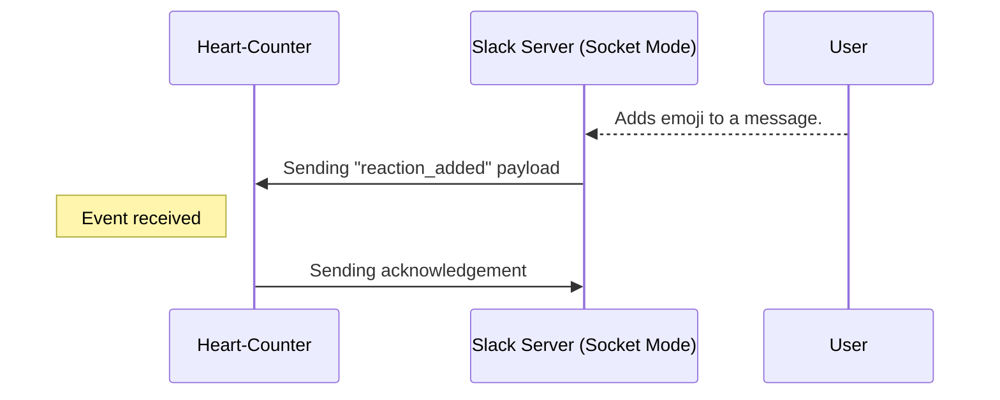
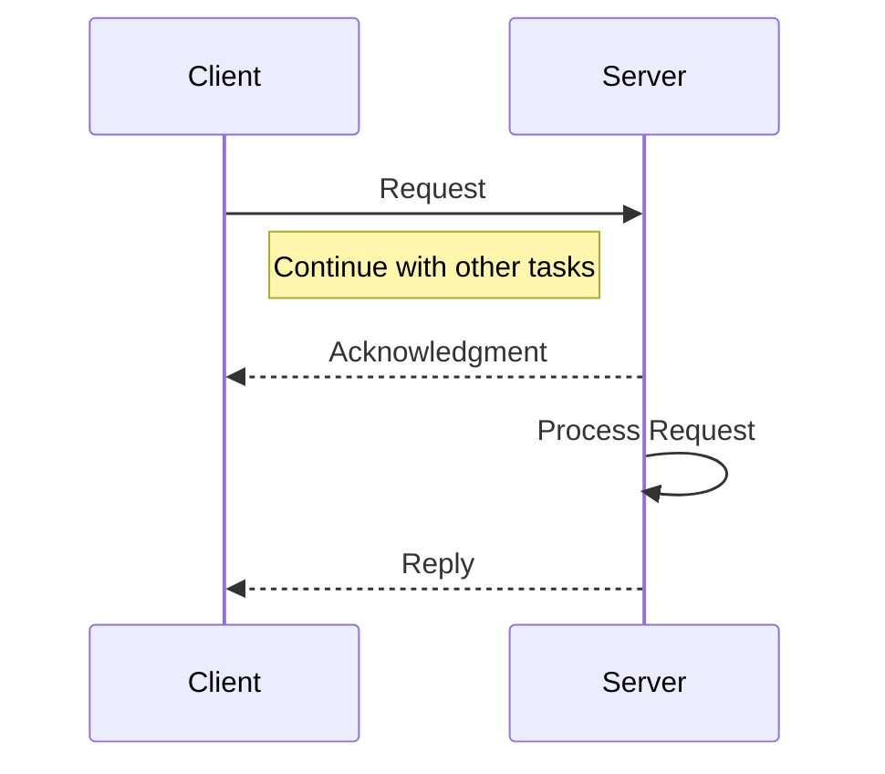

## Introduction
In the [Create an AsyncAPI Document for a Slackbot with WebSockets]() tutorial, you learnt how to write an AsyncAPI document for a Slackbot `Heart-Counter`  that actively monitored reactions associated with a message. In this lesson, let's go a step further. After receiving a reaction, `Heart-Counter` responds by sending a message back to the Slack server through WebSocket to confirm the event reception. 

The interaction where the Slackbot acknowledges the event and replies with a specific response sets the stage for the Request-Reply messaging pattern discussed in this context. The aim of this tutorial is to provide a clear understanding of the Request-Reply Messaging pattern and showcase how AsyncAPI effectively describes it using a practical example.





## Background context

The [Request-Reply Messaging Pattern](https://www.asyncapi.com/docs/tutorials/getting-started/request-reply) in AsyncAPI is an exciting and a highly anticipated feature.  The messaging pattern mirrors a traditional conversation, where one "requester" entity initiates a query or request, and the "responder" entity provides a specific and expected response.
The messaging pattern can work in both synchronous and asynchronous environments and is very beneficial to decouple components by allowing them to operate independently in a distributed system. 




## Define messages

In the `Heart-Counter` tutorial, you dealt with the `hello` event that was triggered when the WebSocket connection was established and the `reaction` event that was expected when a new reaction-added event was triggered.

In this tutorial, you'll be adding the `acknowledge` message to your AsyncAPI document to represent the acknowledgement sent by the Slack application back to the server to indicate that it has successfully received the message.

<CodeBlock language="yaml">
{`components:
  messages:
    reaction:
      summary: Action triggered when the channel receives a new reaction-added event
      payload:
        $ref: '#/components/schemas/reaction'
    hello:
      summary: Action triggered when a successful WebSocket connection is established
      payload:
        $ref: '#/components/schemas/hello'
    acknowledge:
      summary: Acknowledgement response sent to Server
      payload:
        $ref: '#/components/schemas/acknowledge' `}
</CodeBlock>
```

## Define schemas

Previously, the `reaction` schema was simplified to just include the `event` payload. However, in this instance, you will be elaborating on the schema for the complete request it is anticipated to receive.

<Remember>
The sample request and response payloads are extracted from <a href="https://api.slack.com/apis/connections/socket#events">Slack's official documentation</a>.
</Remember>

<CodeBlock language="yaml">
{`  schemas:
    hello:
      type: object
      properties:
        type:
          type: string
          description: A hello string confirming WebSocket connection
          const: hello
        connection_info:
          type: object
          properties:
            app_id:
              type: string
        num_connections:
          type: integer
        debug_info:
          type: object
          properties:
            host:
              type: string
            started:
              type: string
            build_number:
              type: integer
            approximate_connection_time:
              type: integer
    reaction:
      type: object
      properties:
        envelope_id:
          type: string
          description: 'Unique ID assigned to payload'
        payload:
          type: object
          description: 'Payload of the reaction added event'
          properties:
            token:
              type: string
            team_id:
              type: string
            event:
              type: object
              properties:
                user:
                  type: string
                  description: User ID who performed this event
                reaction:
                  type: string
                  description: The only reaction that we need is a heart emoji
                  const: heart
                item_user:
                  type: string
                  description: >-
                    User ID that created the original item that has been reacted
                    to
                item:
                  type: object
                  properties:
                    channel:
                      type: string
                      description: Channel information of original message
                    ts:
                      type: string
                      description: Timestamp information of original message
                event_ts:
                  type: string
                  description: Reaction timestamp
        type:
          type: string
        accepts_response_payload:
          type: boolean `}
</CodeBlock>

Additionally, you will also be adding the `acknowledge` schema that makes use of the `envelope_id` attribute to send a reply back to Slack acknowledging that event has been received.

<CodeBlock language="yaml">
{`    acknowledge:
      type: object
      properties:
        envelope_id:
          type: string
          description: 'Unique ID of acknowledged payload'
        payload:
          type: object
          description: 'Optional payload of event' `}
</CodeBlock>

## Define channels 
Since the `Heart-Counter` makes use of just one WebSocket channel for communication you can define the `root` channel. The channel can accommodate different types of messages, which in our example is the `hello`, `reaction` and `acknowledge` message.

<CodeBlock language="yaml">
{`channels:
  root:
    address: /
    messages:
      hello:
        $ref: '#/components/messages/hello'
      reaction:
        $ref: '#/components/messages/reaction'
      acknowledge:
        $ref: '#/components/messages/acknowledge' `}
</CodeBlock>

## Define operations

That brings to the important part of the tutorial where we get to finally represent the request reply pattern. 

Both `helloListener` and `reactionListener` operations are set to `receive` events. However, in the case of `reactionListener` we also want to represent the message that is sent back to the server. This is where the `reply` attribute comes into play. 

Since both the request and reply function happens over the same WebSocket URL, both the `channel` values stay the same. However, we can differentiate the message each operation conveys by specifying the message it will send or receive. 
Thus, we can say that for a `reaction` message received over the `root` channel, the `reactionListener` operation will reply with the `acknowledge` message over the same channel.

<CodeBlock language="yaml">
{`operations:
  helloListener:
    action: receive
    channel:
      $ref: '#/channels/root'
    messages:
      - $ref: '#/channels/root/messages/hello'

  reactionListener:
    action: receive
    channel: 
      $ref: '#/channels/root'
    messages:
      - $ref: '#/channels/root/messages/reaction'
    reply:
      messages:
        - $ref: '#/channels/root/messages/acknowledge'      
      channel: 
        $ref: '#/channels/root' `}
</CodeBlock>

Putting all this together, we have our AsyncAPI document ready to go!
<CodeBlock language="yaml">
{`asyncapi: 3.0.0
info:
  title: Implement Request Reply in an AsyncAPI Document for a Slack App
  version: 1.0.0
  description: >
    The Heart-Counter manages popular messages in a Slack workspace by
    monitoring message reaction data. It also sends an acknowledgment message
    back to the Slack Server to indicate it has received the message.
servers:
  production:
    host: wss-primary.slack.com
    pathname: /link
    protocol: wss
    description: Slack's server in Socket Mode for real-time communication
channels:
  root:
    address: /
    messages:
      hello:
        $ref: '#/components/messages/hello'
      reaction:
        $ref: '#/components/messages/reaction'
      acknowledge:
        $ref: '#/components/messages/acknowledge'
    bindings:
      ws:
        query:
          type: object
          description: >-
            Tokens are produced in the WebSocket URL generated from the
            [apps.connections.open](https://api.slack.com/methods/apps.connections.open)
            method from Slack's API
          properties:
            ticket:
              type: string
              description: Temporary token generated when connection is initiated
              const: 13748dac-b866-4ea7-b98e-4fb7895c0a7f
            app_id:
              type: string
              description: Unique identifier assigned to the Slack app
              const: fe684dfa62159c6ac646beeac31c8f4ef415e4f39c626c2dbd1530e3a690892f
operations:
  helloListener:
    action: receive
    channel:
      $ref: '#/channels/root'
    messages:
      - $ref: '#/channels/root/messages/hello'
  reactionListener:
    action: receive
    channel:
      $ref: '#/channels/root'
    messages:
      - $ref: '#/channels/root/messages/reaction'
    reply:
      messages:
        - $ref: '#/channels/root/messages/acknowledge'
      channel:
        $ref: '#/channels/root'
components:
  messages:
    reaction:
      summary: Action triggered when the channel receives a new reaction-added event
      payload:
        $ref: '#/components/schemas/reaction'
    hello:
      summary: Action triggered when a successful WebSocket connection is established
      payload:
        $ref: '#/components/schemas/hello'
    acknowledge:
      summary: Acknowledgement response sent to Server
      payload:
        $ref: '#/components/schemas/acknowledge'
  schemas:
    hello:
      type: object
      properties:
        type:
          type: string
          description: A hello string confirming WebSocket connection
          const: hello
        connection_info:
          type: object
          properties:
            app_id:
              type: string
        num_connections:
          type: integer
        debug_info:
          type: object
          properties:
            host:
              type: string
            started:
              type: string
            build_number:
              type: integer
            approximate_connection_time:
              type: integer
    reaction:
      type: object
      properties:
        envelope_id:
          type: string
          description: 'Unique ID assigned to payload'
        payload:
          type: object
          description: 'Payload of the reaction added event'
          properties:
            token:
              type: string
            team_id:
              type: string
            event:
              type: object
              properties:
                user:
                  type: string
                  description: User ID who performed this event
                reaction:
                  type: string
                  description: The only reaction that we need is a heart emoji
                  const: heart
                item_user:
                  type: string
                  description: >-
                    User ID that created the original item that has been reacted
                    to
                item:
                  type: object
                  properties:
                    channel:
                      type: string
                      description: Channel information of original message
                    ts:
                      type: string
                      description: Timestamp information of original message
                event_ts:
                  type: string
                  description: Reaction timestamp
        type:
          type: string
        accepts_response_payload:
          type: boolean
    acknowledge:
      type: object
      properties:
        envelope_id:
          type: string
          description: 'Unique ID of acknowledged payload'
        payload:
          type: object
          description: 'Optional payload of event' `}
</CodeBlock>

## Summary
Great job getting to the end! In this tutorial you learnt how to create an AsyncAPI document for a use case that implemented the Request Reply messaging pattern. Now you can try exploring this pattern with sub patterns to see how it works with different use cases in real life. 
